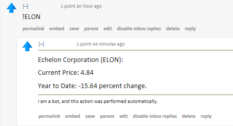

# T!ckr
A python reddit bot which supplies stock information when given a ticker command.

## Instructions:
```shell
$ pip install -r requirements.txt
$ python manage.py
```
When initially starting the program, it is important to edit the praw.ini file that is installed in your default Python pip directory.
Move it to the project directory. This is where authorization is done. On Reddit, under user preferences/apps, you can find two keys 
after creating a personal script. These are the secret key and the user key.
```python
[bot1]
client_id=user_key (shorter-string of random characters)
client_secret=secret_key (long-string of random characters)
password=insert_password
username=insert_user
user_agent=PyEng Bot 0.1
```
Each can be found under the app information for your new script. Place them accordingly, as shown above. 
If you don't include a Reddit username and password the bot will not be able to comment.
## How it Works:
RedditStock looks for ticker symbols preceded by an exclamation mark, and returns neatly formatted data to the requesting user 
in the form of a comment.



### Things to Note:
This bot runs off of a custom made csv file with NASDAQ and NYSE entries. If you wish to modify the CSV file, you must rebuild the
alphabetically sorted text file which tells the program where to start looking when given a ticker (when it searches for the company 
name). You can do this using
```shell
python rebuild.py
```
in your command line. Just remember the CSV file must be alphabetically ordered.


